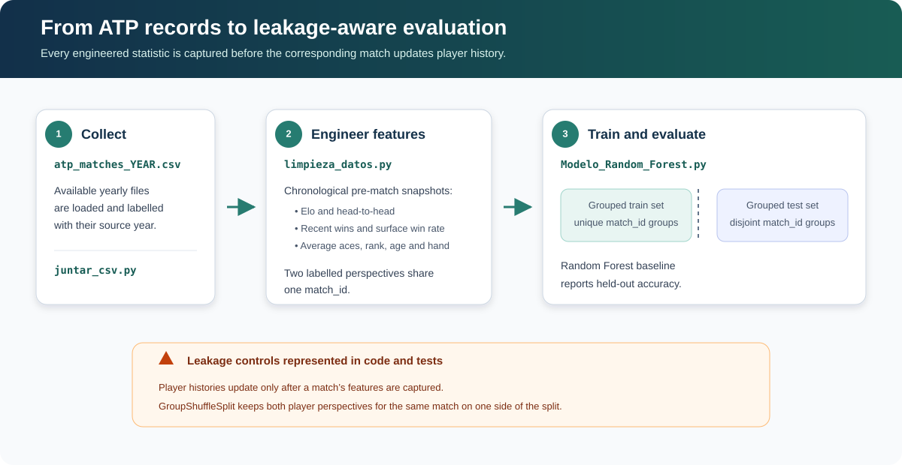

# Tennis Match Predictor

A reproducible Python pipeline that combines yearly ATP match files, builds chronological pre-match features, and evaluates a Random Forest classifier.

> This is an educational project, not a betting or financial decision system. Historical accuracy does not guarantee future performance.

## Pipeline at a glance



*The pipeline derives each feature from information available before the match, then keeps both labelled perspectives of that match in the same evaluation split.*

## What the pipeline does

1. `juntar_csv.py` combines available `atp_matches_YEAR.csv` files.
2. `limpieza_datos.py` sorts matches chronologically and calculates pre-match Elo, head-to-head, recent-form, surface win-rate, and average-ace features.
3. `Modelo_Random_Forest.py` trains and evaluates a Random Forest model.

Each source match produces two labelled player perspectives. Both perspectives share a `match_id`, and the train/test split is grouped by that ID so the same match cannot appear in both sets. Match statistics are accumulated only after creating that match's features to avoid target leakage.

## Requirements

- Python 3.10 or newer
- Yearly ATP CSV files named `atp_matches_YYYY.csv`

The repository does not redistribute match data. One compatible public source is the [Jeff Sackmann tennis_atp dataset](https://github.com/JeffSackmann/tennis_atp); review its documentation and data terms before use.

## Setup

```bash
python3 -m venv .venv
source .venv/bin/activate
python -m pip install --upgrade pip
python -m pip install -r requirements.txt
```

## Usage

Place yearly files in `data/`, then run:

```bash
python juntar_csv.py --data-dir data --start-year 1968 --end-year 2024
python limpieza_datos.py data/atp_matches_1968_2024_completo.csv --output tennis_model_dataset.csv
python Modelo_Random_Forest.py tennis_model_dataset.csv
```

Use `python SCRIPT.py --help` to see all options. Paths are configurable; the scripts do not depend on a specific user's filesystem.

## Development and validation

```bash
python -m pip install -r requirements-dev.txt
python -m compileall -q Modelo_Random_Forest.py limpieza_datos.py juntar_csv.py tests
ruff check .
pytest
pip-audit -r requirements.txt
pip-audit --local
```

GitHub Actions runs the same compilation, lint, test, and dependency-audit checks for pushes and pull requests.

## Limitations

- Prediction quality depends on the completeness and quality of the source data.
- The current features and hyperparameters are a baseline, not a calibrated production model.
- The grouped split prevents duplicate-match leakage, but it is not a forward-chaining evaluation. For claims about future performance, use a strict chronological holdout.
- Generated datasets and trained model artifacts are intentionally excluded from Git because they can be large and may have separate licensing requirements.

## License

The source code is available under the [MIT License](LICENSE). Third-party datasets retain their own terms.
